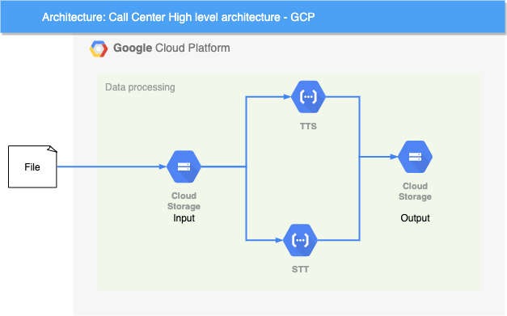

# telstra-id-analyser
GCP pipeline to do AI analysis of phone calls and messages.

## How to Deploy
---

TL;DR

1. Create new GCP project.
1. \# gcloud config set <project_id>
1. \# ./deploy.sh

# TELSTRA INNOVATION DATA DATA ANALYSER

This tool will enable AI for call-like resources (call scripts and audios). The system monitors an input Google Cloud Storage (input bucket) and will process the files that are saved.

* If the input file is a script (extensions to be processed as scripts defined in the TEXT_EXT variable in "config.sh"), the system will generate an audio file using the Text To Speech API (TTS), and store it in the output bucket.
* If the input file is a audio file (extensions to be processed as audio defined in the VOICE_EXT variable in "config.sh"), the system will generate the script using the Speech To Text (STT) API, and store it in the output bucket.

## Deployed infrastructure

---

* Input bucket (Name defined in INPUT_BUCKET variable in "config.sh")
* Output bucket (Name defined in RESULTS_BUCKET variable in "config.sh")
* Google Cloud Function for TTS and STT API processing (Analyser Handler)

## Architecture Diagram

---

## To Do - Hackathon Activities

---

1. Update function to call a Natural Language API to do Natural Language Processing (NLP)

1. Create a RESTfull API to store the APIs results:
    * Enable a Cloud Datastore to save the information
    * Create a API to query the information in the DataStore
    * Create a Cloud EndPoint to expose the API to internet
    

